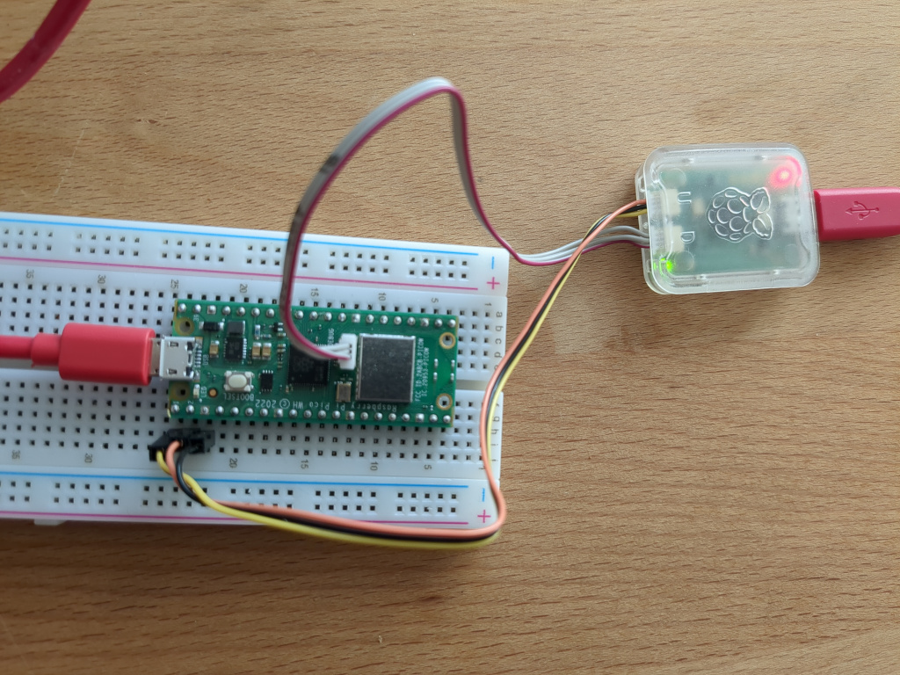

# Pico with Embassy

Read temperature values and write them to an MQTT topic.

The Raspberry Pi Pico is well supported by [embassy](https://embassy.dev), apart
from the bluetooth stack (for legal reasons). As we do not use bluetooth for
communication we can ignore that.

## Flashing

There are two ways of getting the code onto the microcontroller.

### elf2uf2

Compile the binary as normal, convert it into a uf2 firmware which is flashable
to the pico with only an USB connection. Disadvantage of this apporach is that
it is more annoying to do and does not lend itself to debugging.

- Clone the [elf2uf2](https://github.com/rej696/elf2uf2) repository and follow
  its instructions to compile the tool
- Compile the controller code with `cargo build --release`
- Convert the resulting binary with something like
  `elf2uf2 target/thumbv6m-none-eabi/release/controller ./controller.uf2`
- Hold the bootselect button of the pico when plugging it in
- Copy the uf2 file to the mass storage device

### CMSIS-DAP

Use the [CMSIS-DAP](https://arm-software.github.io/CMSIS_5/DAP/html/index.html)
protocol for flashing and debugging.

The
[raspberry pi debug probe](https://www.raspberrypi.com/documentation/microcontrollers/debug-probe.html)
works well but anything implementing that protocol is fine.

 _Example setup with a Pico WH
(Pico W works as well, just a bit more annoying)_

- Setup debug probe
- Install [probe-rs](https://github.com/probe-rs/probe-rs/)
- Run `cargo run` and it should upload and logs be visible

## Configuration

Configuration is done by sending commands across a serial connection. Only one
command is implemented for now: Set-config with two parameters.

A sample set-config command looks like this (not encoded yet): `SC ssid MyNet`.
It consists of three parts:

- `SC`: Command prefix, always the same.
- `ssid`: Configuration key.
- `MyNet`: Configuration value.

The following keys are recognized:

- `ssid`: Name of the network to connect to.
- `ssid_pw`: Password to connect to the network.
- `mqtt`: URL of the MQTT broker (must not use https).
- `client_id`: ID of the device (used for identifaction in MQTT).

A message needs to be encoded into its byte representation looking on a high
level as follows:

```
|<parameters>|<parameter-lengths>|<prefix>|<parameters>|
```

- `Parameters` is an unsigned byte signifying the amount of parameters in the
  message.
- `Parameter-Lengths`: Length of each parameter.
- `Prefix` is always two bytes long and encoded as UTF-8 (meaning it is
  basically ASCII).
- `Parameters`: every parameter encodes is own length in its first byte,
  followed by the actual data.

Taking the above ssid example this would lead to this (the prefix counts as its
own parameter):

```
0x03 0x02 0x04 0x05 0x53 0x43 0x73 0x73 0x69 0x64 0x4D 0x59 0x4E 0x65 0x74
```

Now the COBS encoding is applied before sending it across the wire:

```
0x10 0x03 0x02 0x04 0x05 0x53 0x43 0x73 0x73 0x69 0x64 0x4d 0x79 0x4e 0x65 0x74
```

In this case (as in most) it merely adds two additional bytes (the last 0x00
byte is implied).

Sending this this command on linux, assuming the serial connection is accessible
on `/dev/ttyACM1`:

```
echo -en "\x10\x03\x02\x04\x05\x53\x43\x73\x73\x69\x64\x4d\x79\x4e\x65\x74\x00" > /dev/ttyACM1
```

If listening to the serial connection, command acknowledgements like `OK` or
`ERROR` can be seen.

In order to decode a message, apply the above steps in reverse order.

All configuration is read on startup of the microcontroller.

## Outlook

- Pull the flash/config handling into separate library for testability
- Merge different ways of running tasks (join and tasks)
- Figure out how to add this project to the overall rust workspace
