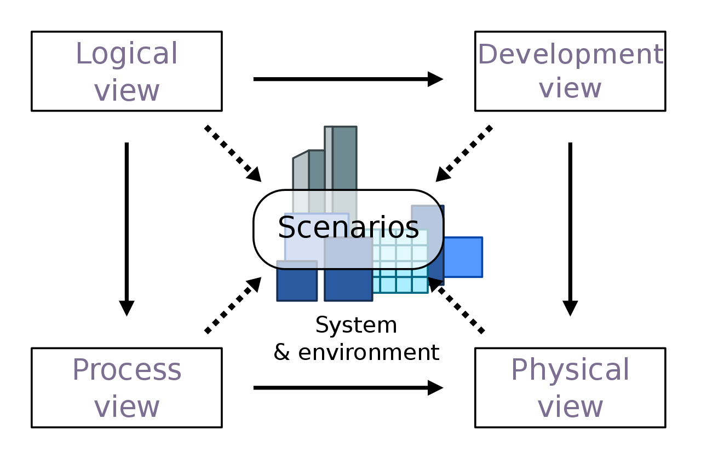

# 4+1 Model

The 4+1 model describes a software architecture from four main perspectives,
as well as a set of additional *use cases* or *scenarios*.
The central premise of this model is that different stakeholders
of a software project have different needs toward its architecture.
The four views seek to address these diverse needs.

This model was originally proposed by Philippe Kruchten[^1].

    

    
    

image source: Wikipedia[^2]

## The Logical View

Our domain model is embarrassingly simple.
There are temperature measurements and they don't do much beyond existing.
We shall resist the urge to add a second entity
modeling the aggregation of the first,
just to make this diagram look more interesting.

    

    
    

## The Process View

Our system can only have one web service process,
as it is responsible for ensuring data consistency.
Removing this limitation would entail extracting the data storage layer
into a separate process.
This is not of any use at the level of load we are dealing with.
The microcontroller is also only a single process.
Our data model does not allow to distinguish between
temperature measurements from different sensors.
However, there may be an arbitrary number of client processes running the SPA.

As for the communication, it is one-way between microcontroller and web service.
The web service does not need to send any data to the microcontroller.
Between the web service and the SPA, communication is bidirectional.
(HTTP requests in one direction, WebSocket messages in the other.)

There is little going on in terms of synchronization.
Microcontroller and SPA are stateless processes on a high-level
and they communicate via stateless protocols.
The web service needs to ensure data consistency across several concurrent
requests, but this is an internal concern of the web service not relevant
at this level of abstraction.

## The Development View

As a fairily standard Rust project, our software is organized into crates[^3].
- `models` contains the domain model and other shared data types
- `app` contains the SPA
- `server` contains the web service

Within these crates, the code is organized into modules.
While these diagrams bear some resemblance to the C4 component diagsams,
we are here not concerned with interactions or data flow.
This diagram only shows depencencies between modules.
Note that not all modules are shown,
only the ones deemed important from an architectural standpoint.

## The Physical View

We omit the diagram for the physical view, as there is not much to show.
We have no redundancy, no scalability, no backups, no variable environments.
The physical view looks essentially identical to the process view.

## Scenarios

The scenarios are the central use cases of the application.
They serve to validate and justify the architecture.
Any aspect of the previous four architecture views
is to be judged by how well it supports these scenarios.

### User connects to web service

When a user connects to the web service, typically using a browser,
they request all current data via HTTP and open a WebSocket connection
to subscribe to notifications for as long as the connection stays open.

    

    
    

### Microcontroller sends new temperature measurement

When the microcontroller sends a new temperature measurement,
the web service stores it in the database and sends a notification
to all currently connected clients.

[^1]: [https://www.cs.ubc.ca/~gregor/teaching/papers/4+1view-architecture.pdf](https://www.cs.ubc.ca/~gregor/teaching/papers/4+1view-architecture.pdf)

[^2]: [https://en.wikipedia.org/wiki/4%2B1_architectural_view_model#/media/File:4+1_Architectural_View_Model.svg](https://en.wikipedia.org/wiki/4%2B1_architectural_view_model#/media/File:4+1_Architectural_View_Model.svg)

[^3]: A crate is a compilation unit. The crate depencency graph must be acyclic.
      By contrast, modules in Rust are simply a way to organize code within a crate.
