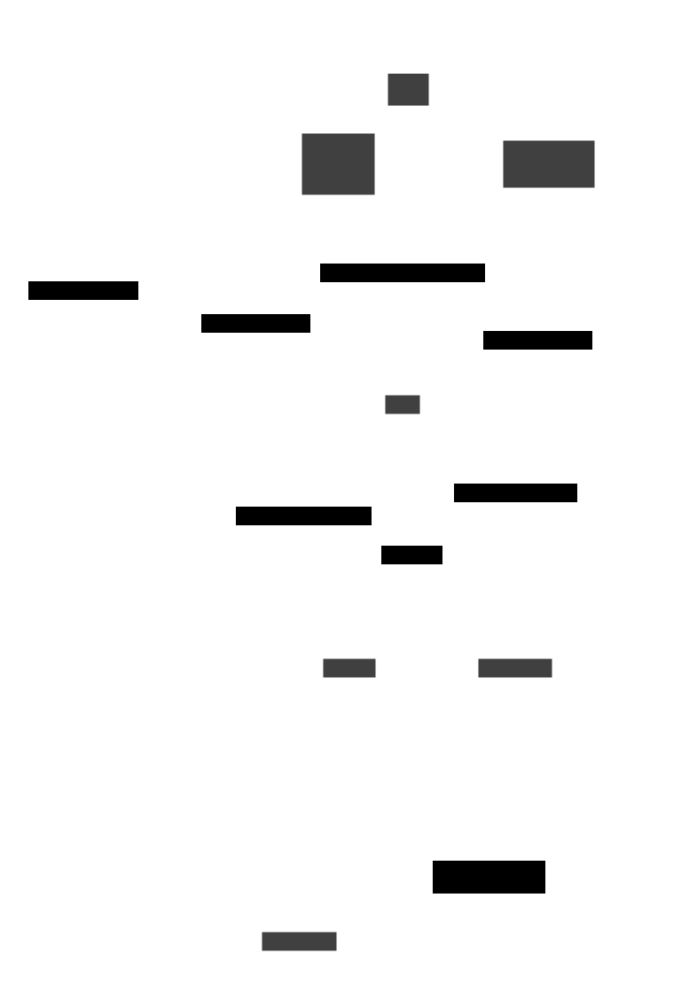

# C4 Model

<!-- https://c4model.com/ -->

The following documentation represents one view of our architecture, centered around the diagrams of the C4 model.

We omit the system context diagram, because it would not add any value.
We have no interactions with other software systems and there is only one, simple user interaction.

## C4 Container Diagram

The C4 container diagram shows all containers, i.e. deployment units, of a software system.
It also shows the major technology choices and how the containers communicate with one another[^1].
As our three containers are necessarily deployed in distinct physical locations, this is the simplest possible architecture compliant with the project's requirements.

    

    
    

## C4 Component Diagrams

These diagrams show the internal high-level structure of each container.

### Web Service

Several auxiliary modules which aren't relevant to the overall structure of the web service are omitted from this view.

### SPA

The component diagram of the SPA closely resembles that of the generic flux pattern (or more precisely, Redux' simpified version of it).
Applying this state management pattern in the frontend is a project requirement.

### Microcontroller

TODO

[^1]: [https://c4model.com/#ContainerDiagram](https://c4model.com/#ContainerDiagram)
